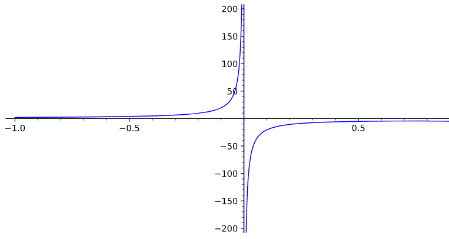

## *Mean Girls*

Friday's tutorial prompted a discussion of the math competition towards the end of the 2004 film [Mean Girls](https://www.imdb.com/title/tt0377092/), an American High School comedy.

I haven't seen the film, but looked up the <a href="https://www.youtube.com/watch?v=qscPswsNzpw" target="_blank">math competition scene</a>.

Fortunately, the mathematics in the movie is correct, if poorly type-set (functions names $\sin$, $\ln$, etc should be in normal upright font, not *italics*). Unfortunately, the quiz announcer reads out the questions as "Find the limit of this equation.", which grates. It's not an equation is it -- I don't see an equals sign!

Here's the limit
$$\lim_{x \to 0}\left ( \frac{\ln(1-x) - \sin(x)}{1- \cos^2(x)}\right ).$$

The way to deal with the limit is not so much to start applying the $\epsilon, \delta$ definition directly, as this is a complicated compound function and the interplay between $\epsilon$ and $\delta$ values will be quite tricky to handle. 

Instead we would treat this problem with the aid of the theory of limits of compound functions, the derivative and in particular l'Ho&#770;pital's rule.

l'Ho&#770;pital's rule is useful in situations where we have two functions $f(x)$ and $g(x)$ and $f(0)=g(0)=0$, so that we cannot judge $\lim_{x \to 0}f(x)/g(x)$ by using a quotient rule for limits as the limit would seemingly be $0/0$, which is meaningless. The rule says that we can judge the limit of their quotient by examining the limit of the quotient of their derivatives, i.e.
$$\lim_{x \to 0} \frac{f(x)}{g(x)}
= \lim_{x \to 0} \frac{f'(x)}{g'(x)},$$
where $f'$ and $g'$ denote the derivatives. 

Applying this result here will say 
$$\begin{align*}
\lim_{x \to 0} \left ( \frac{\ln(1-x) - \sin(x)}{1- \cos^2(x)} \right )
&= \lim_{x \to 0} \left ( \frac{\frac{-1}{1-x} - \cos(x)}{-2\cos(x)\sin(x)}\right )
\end{align*}$$

Now in the quotient on the right-hand side, the numerator evaluates to $-2$ at $x=0$ and the denominator evaluates to $0$ at $x=0$. This means that as $x$ tends to $0$, the quotient will be tending to behave like $2/\alpha$, where $\alpha$ is a very small quantity, perhaps negative, perhaps positive. So we can see that the absolute value of the quotient will be increasing without any upper bound. Or in other words, "*The limit doesn't exist!*".

Lindsey Lohan's character, Cady, comes to this conclusion after thinking hard and remembering back to her math classes, removing the vision of the twinkly-eyed dufus seated at the desk in front of hers, and instead recalling the lecture on the subject from her teacher, played by the actor and film's writer, Tina Fey. 

A computer plot of the function, readily confirms these conclusions. 

We will be discussing these topics in detail later in the unit. 

